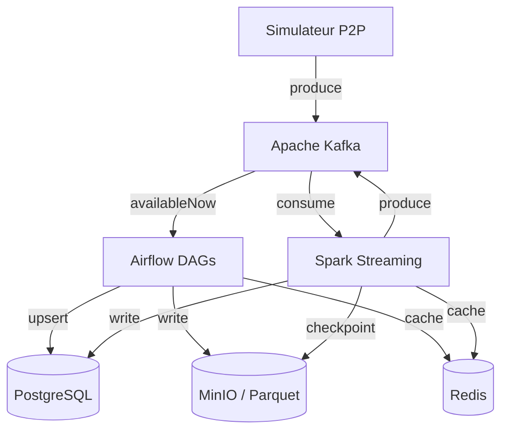

# Architecture SPOTIFY


## Vision d'ensemble


---

## Décisions architecturales

### ETL vs ELT — Mapping par pipeline

| Pipeline | Approche | Justification |
|----------|----------|---------------|
| catalog_ingestion | **ETL** | Les données du catalogue doivent être nettoyées, validées et normalisées (ex: typage UUID) avant d'entrer dans PostgreSQL pour garantir l'intégrité référentielle. |
| streaming_events | **ELT** | Les événements bruts sont ingérés massivement vers MinIO et PostgreSQL (zone staging/raw). Les transformations complexes sont effectuées après le chargement pour optimiser le débit d'ingestion. |
| aggregation | **ELT** | On utilise la puissance de calcul de PostgreSQL ou Spark pour transformer les données déjà chargées (`listening_events`) en agrégats métier (`daily_streams`, `artist_stats`). |
| streaming_trends (Spark) | **ETL** | En mode streaming, Spark transforme le flux en vol (fenêtrage de 5 min, calcul de scores) avant de charger le résultat consolidé en base. |

### Partitionnement Parquet

Expliquer ici votre stratégie de partitionnement des fichiers Parquet sur MinIO.

```
spotify-parquet/
└── listening_events/
    └── date=2025-01-15/
        └── hour=14/
            └── part-00000.parquet
```

**Pourquoi cette structure ?**
→ Le partitionnement par `date` et `hour` est optimal pour les données de séries temporelles comme les `listening_events`. Il permet :
1. **Partition Pruning** : Les requêtes analytiques qui ciblent une plage de temps spécifique n'ont pas besoin de scanner l'ensemble des données. Elles ne lisent que les dossiers concernés (ex: `date=2025-01-15`), ce qui réduit drastiquement les I/O.
2. **Gestion du cycle de vie** : Rend aisé l'archivage ou la suppression des vieilles données de façon sélective et indépendante sans avoir à réécrire des fichiers massifs.
3. **Parallélisme** : Facilite le travail des pipelines batch (Airflow) et du requêtage distribué (Spark) qui peuvent traiter chaque "bucket" temporel en parallèle de façon idempotente.

### Topics Kafka — Stratégie de partitionnement

| Topic | Partitions | Clé | Justification |
|-------|-----------|-----|---------------|
| listening_events | 6 | user_id | Garantit que tous les événements d'un même utilisateur sont traités dans l'ordre par la partition. |
| p2p_network_events | 6 | peer_id | Permet de reconstituer correctement l'historique de connexion d'un peer spécifique de manière ordonnée. |
| catalog_updates | 3 | track_id | Assure d'éviter les `race conditions` (conditions de course) lors des mises à jour des métadonnées d'une piste. |
| fraud_alerts | 3 | user_id | Les alertes d'un même utilisateur restent ordonnées en vue de leur traitement par le système de bannissement en aval. |

**Pourquoi `user_id` comme clé pour `listening_events` ?**
→ Utiliser `user_id` comme clé de partitionnement garantit que tous les événements provenant d'un même utilisateur sont routés vers la même partition Kafka. Au niveau du consommateur, cela permet de garantir l'ordre chronologique strict du traitement de ces événements, ce qui est extrêmement important pour la reconstitution de sessions d'écoutes ou la détection précise de fraudes algorithmiques (ex. burst streams).

---

## Choix techniques

### Pourquoi CeleryExecutor (pas KubernetesExecutor) ?

→ Pour notre infrastructure reposant sur un `docker-compose` avec Apache Kafka, Spark, PostgreSQL, MinIO et Redis, le `CeleryExecutor` est beaucoup plus adapté. Airflow peut utiliser le container Redis existant comme message broker sans nécessiter d'autre infrastructure. C'est robuste, simple à faire scaler statiquement avec des process workers dédiés, contrairement au `KubernetesExecutor` qui requerrait de déployer et de maintenir un cluster Kubernetes entier pour la manipulation de pods éphémères.

### Gestion des secrets

→ Les identifiants (PostgreSQL password, MinIO keys) sont stockés sous forme de variables d'environnement dans un fichier `.env` dé-versionné (ignoré par le fichier `.gitignore`). Les containers du `docker-compose.yml` chargent ces variables localement de façon sécurisée (un `.env.example` sert juste de template pour l'initialisation du projet).

---

## Architecture Lambda — Batch + Speed Layer

```
Speed layer  : Simulateur → Kafka → Spark → PostgreSQL (realtime_*) + Redis
Batch layer  : Simulateur → Kafka (availableNow) → Airflow → PostgreSQL (daily_*) + MinIO
Serving layer: PostgreSQL + Redis ← consommé par les clients
```

**Ce qui est en batch et pourquoi :**
→ **L'agrégation des analytiques (ex: `daily_streams` et `artist_stats`)**. Ces données nécessitent une grande consistance (table de vérité pour le paiement des ayants droit ou les royalties) et doivent englober la totalité des logs d'une journée, y compris ceux arrivés tardivement. Le batch est parfaitement optimisé via Airflow pour de telles charges lourdes.

**Ce qui est en streaming et pourquoi :**
→ **Calcul des `realtime_top_tracks` et la détection de fraudes associées (`fraud_alerts`)**. L'application musicale a besoin de réactivité pour afficher ce que les gens écoutent à l'instant T (fenêtrage par exemple de 5 min) car c'est crucial pour l'UX. Le streaming répond également à la nécessité quasi immédiate de repérer et stopper un comportement malveillant (piratage ou burst de fake streams par des bots) limitant les impacts pour l'entreprise côté royalties.

---

## Schémas d'événements

### listening_event

```json
{
  "event_id":    "uuid",
  "user_id":     "uuid",
  "track_id":    "uuid",
  "source_peer": "uuid",
  "timestamp":   "2025-01-15T14:30:00Z",
  "duration_ms": 45000,
  "device_type": "mobile",
  "geo_country": "FR",
  "completed":   true,
  "event_source": "p2p"
}
```

### p2p_network_event

```json
{
  "event_id":   "uuid",
  "event_type": "chunk_transfer",
  "peer_id":    "uuid",
  "target_peer": "uuid",
  "track_id":   "uuid",
  "chunk_size_bytes": 65536,
  "latency_ms": 12,
  "timestamp":  "2025-01-15T14:30:01Z"
}
```

---

## Leçons apprises

> À compléter au fur et à mesure de la semaine.

- **Lundi** : ...
- **Mardi** : ...
- **Mercredi** : ...
- **Jeudi** : ...
- **Vendredi** : ...
