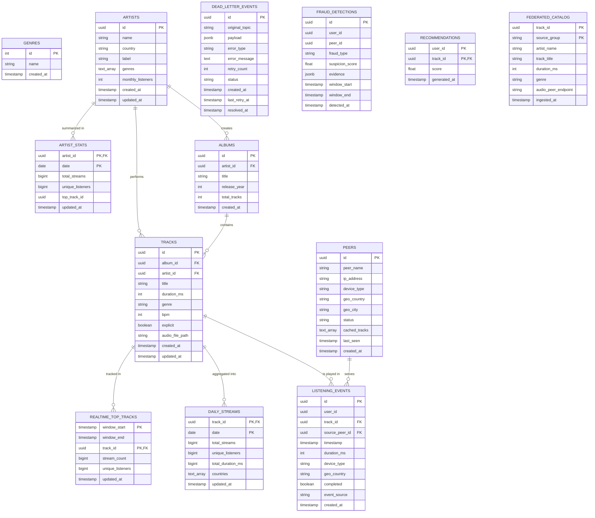

# Data Model - Spotify Pipeline

## Entity Relationship Diagram (ERD)

## Questions & Answers

### 1. Pourquoi `listening_events` est indexé sur `(timestamp)` ET `date_trunc('hour', timestamp)` ?

*   **`idx_listening_events_timestamp`** : Cet index est crucial pour les requêtes basées sur des plages de temps (ex: `WHERE timestamp > NOW() - INTERVAL '1 day'`). Il permet au moteur SQL de localiser rapidement les lignes dans une fenêtre temporelle continue.
*   **`idx_listening_events_ts_partition`** : Il s'agit d'un **index fonctionnel**. Dans un pipeline de données, on agrège très souvent par heure (`GROUP BY date_trunc('hour', timestamp)`). Sans cet index, PostgreSQL devrait calculer la fonction pour chaque ligne avant de pouvoir regrouper. Avec cet index, il utilise directement les valeurs pré-calculées, ce qui accélère drastiquement les agrégations horaires et permet d'optimiser le "partition pruning" logique si des vues ou des requêtes filtrent par tranches horaires.

### 2. Quelle est la différence entre `daily_streams` (batch) et `realtime_top_tracks` (Spark) ?

*   **`daily_streams` (Batch)** : C'est la table de vérité historique. Elle est alimentée par un processus batch (probablement Airflow) qui tourne une fois par jour. Elle consolide les données sur 24h avec une précision maximale, incluant éventuellement des corrections de données tardives. Elle sert au reporting officiel et au calcul des royalties.
*   **`realtime_top_tracks` (Spark Streaming)** : C'est une table de tendance à chaud. Elle est alimentée par Spark Structured Streaming avec des fenêtres glissantes ou fixes de 5 minutes. Elle permet de voir ce qui "buzze" à l'instant T sur la plateforme, mais elle n'a pas vocation à être la source comptable finale (elle peut être sujette à de petits écarts dus au temps réel).

### 3. Pourquoi `dead_letter_events.payload` est JSONB plutôt que TEXT ?

*   **Performance et Structure** : `JSONB` stocke le JSON dans un format binaire décomposé. Contrairement au `TEXT` qui nécessite un parsing complet à chaque lecture, le `JSONB` permet un accès rapide aux champs.
*   **Capacités de Requêtage** : On peut indexer le contenu du `JSONB` (index GIN). Cela permet de faire des recherches complexes dans la DLQ, comme par exemple : "Trouve tous les événements en échec qui concernent le `track_id` X ou qui viennent du `peer_id` Y", directement en SQL avec les opérateurs `@>` ou `->>`.
*   **Validation** : Le type `JSONB` garantit que les données insérées sont du JSON valide, évitant ainsi d'avoir des payloads corrompus dans la file d'erreur.
